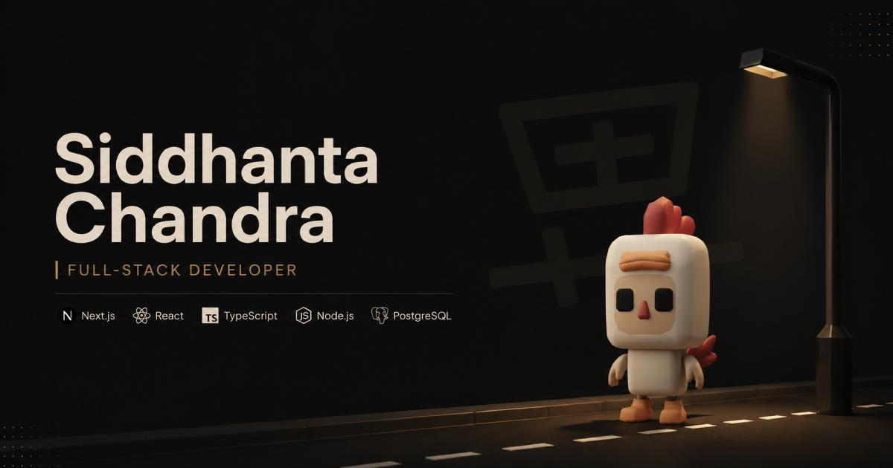

<div align="center">

# sydcodes — Siddhanta Chandra Portfolio

An interactive portfolio featuring a 3D avatar, responsive parallax, and a serverless contact form.

[](https://www.siddhantachandra.com)



[](https://nextjs.org/)
[](https://react.dev/)
[](https://tailwindcss.com/)
[](https://threejs.org/)

[Overview](#overview) · [Features](#features) · [Technical decisions](#technical-decisions) · [Tech stack](#tech-stack) · [Projects](#featured-projects) · [Setup](#getting-started) · [Credits](#credits) · [License](#license)

</div>

## Overview

**sydcodes** is the portfolio and digital playground of [Siddhanta Chandra](https://www.siddhantachandra.com), a full-stack developer based in Kolkata, India. It pairs a responsive Three.js avatar scene and scroll-linked motion with project showcases and a protected contact form.

## Features

- **Interactive 3D avatar:** Three.js loads an animated GLB character with click and <kbd>Space</kbd> jump controls. The scene adapts to desktop, tablet, and mobile viewports.
- **Scroll and parallax motion:** Lenis and Framer Motion provide smooth scrolling, pointer parallax, and responsive project and experience layouts.
- **Contact form:** Cloudflare Turnstile verification precedes server-side email delivery through Nodemailer and Gmail SMTP.
- **Motion preferences:** Framer Motion's `useReducedMotion` hook is used in interactive sections to reduce motion for users who request it.
- **Metadata:** Open Graph metadata and Person/WebSite JSON-LD support sharing and search discovery.

## Technical decisions

- **Load WebGL on the client:** `Scene3dDynamic` imports the Three.js scene from `useEffect`. This keeps browser-only WebGL setup out of server rendering and delays the scene bundle until the client mounts.
- **Defer heavy scene work:** `HeroScene` waits through two animation frames, then uses `requestIdleCallback` (with a timeout fallback) before mounting the 3D scene. This gives the initial hero content a chance to render first.
- **Verify before sending:** The contact form obtains a Turnstile token, posts it with the validated form data to `/api/contact`, and the route checks it with Cloudflare Siteverify before creating a Gmail SMTP message. `GMAIL_USER` is both the sender and the recipient; replies go to the visitor's email. The route validates required fields, email format, and message length. It does not currently implement request rate limiting.

## Tech stack

| Area | Tools |
|---|---|
| Framework | Next.js 16 App Router, React 19 |
| 3D and interaction | Three.js, GLTFLoader, Framer Motion 12, Lenis |
| Styling | Tailwind CSS 4, PostCSS, Inter and Oswald |
| Contact security and email | Cloudflare Turnstile, Nodemailer, Gmail SMTP |
| Analytics | Vercel Web Analytics (production deployments) |
| Deployment | Vercel |
| Code quality | ESLint 9 |

## Getting started

### Requirements

- Node.js **20.9.0 or newer**
- npm, pnpm, or yarn

### Install and run

```bash
git clone https://github.com/SiddhantaChandra/sydcodes.git
cd sydcodes
npm install
cp .env.example .env.local
npm run dev
```

Open [http://localhost:3000](http://localhost:3000). The 3D scene and rest of the portfolio work locally without email credentials. The contact form can be exercised with Cloudflare's always-pass test credentials shown below; real email delivery requires Gmail credentials.

```bash
npm run lint
npm run build
npm run start
```

## Environment variables

Copy `.env.example` to `.env.local` and fill in the values:

| Variable | Use |
|---|---|
| `NEXT_PUBLIC_TURNSTILE_SITE_KEY` | Turnstile widget site key, visible to the browser. Use Cloudflare's test key locally. |
| `TURNSTILE_SECRET_KEY` | Server-side Siteverify secret. Use the matching Cloudflare test secret locally. |
| `GMAIL_USER` | Gmail account used as both sender and recipient for contact submissions. |
| `GMAIL_APP_PASSWORD` | Google App Password used by Nodemailer for SMTP authentication. |

For local development, Cloudflare's documented test pair always passes verification:

```dotenv
NEXT_PUBLIC_TURNSTILE_SITE_KEY=1x00000000000000000000AA
TURNSTILE_SECRET_KEY=1x0000000000000000000000000000000AA
```

Use real Turnstile credentials in production; test keys are for development and testing only. The contact form's email send still needs a working Gmail account and App Password.

## Design system

| Color | Swatch |
|---|---|
| Background `#1d1d1d` |  |
| Primary text `#e7d5c3` |  |
| Crimson `#c23132` |  |
| Coral `#f17c52` |  |
| Sage `#78c9ba` |  |
| Ochre `#d8b16a` |  |

Headings use [Oswald](https://fonts.google.com/specimen/Oswald); body text uses [Inter](https://fonts.google.com/specimen/Inter).

## Repository structure

<details>
<summary>Browse the main files</summary>

```text
sydcodes/
├── app/
│   ├── api/contact/route.js          # Turnstile verification and SMTP delivery
│   ├── components/
│   │   ├── Contact/ContactForm.js
│   │   ├── Hero/                     # Responsive scenes and hero content
│   │   ├── Scene3d.js                # Three.js model, camera, lighting, jump physics
│   │   ├── Scene3dDynamic.js         # Client-side scene import
│   │   └── SmoothScroll.js
│   ├── sections/                     # Hero, experience, projects, contact, and more
│   ├── globals.css
│   ├── layout.js
│   └── page.js
├── public/
│   ├── 3d_asset/                     # Animated character model
│   ├── og/og-image-home.jpg
│   ├── project-image/
│   └── scene/                        # Desktop, tablet, and mobile backgrounds
├── .env.example
├── LICENSE
└── package.json
```

</details>

## Contact

**Siddhanta Chandra** · Full-stack developer · Kolkata, India

[Portfolio](https://www.siddhantachandra.com) · [Contact form](https://www.siddhantachandra.com/#contact) · [LinkedIn](https://www.linkedin.com/in/siddhantachandra/) · [GitHub](https://github.com/SiddhantaChandra)

## Credits

- 3D character model: [CUTES Part One](https://poly.pizza/bundle/CUTES-Part-One-WD91WrT0gx) by [J-Toastie](https://poly.pizza/u/J-Toastie), licensed under [CC-BY 3.0](https://creativecommons.org/licenses/by/3.0/), via [Poly Pizza](https://poly.pizza/).

## License

The original code in this repository is licensed under the [MIT License](LICENSE). Third-party assets and dependencies remain under their respective licenses; in particular, the 3D character model is CC-BY 3.0 and requires attribution as listed in [Credits](#credits).

This is a personal portfolio repository and is **not accepting pull requests**. Feel free to browse and fork it under the license terms.
